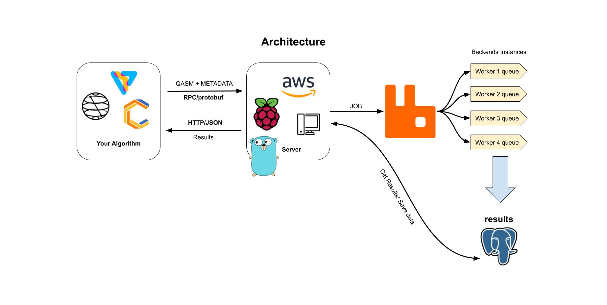
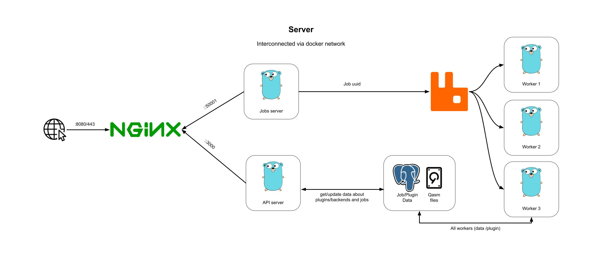
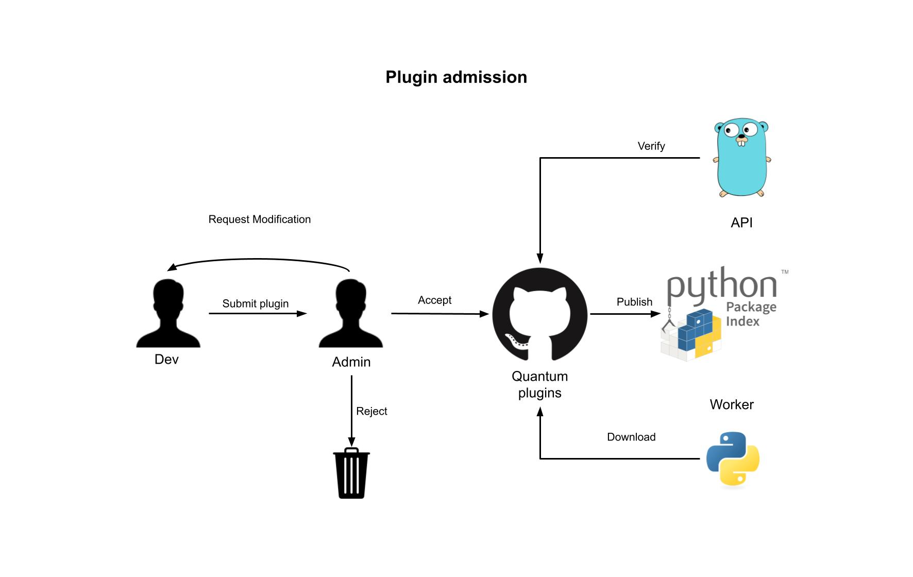
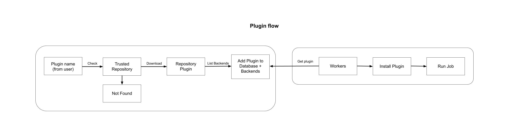
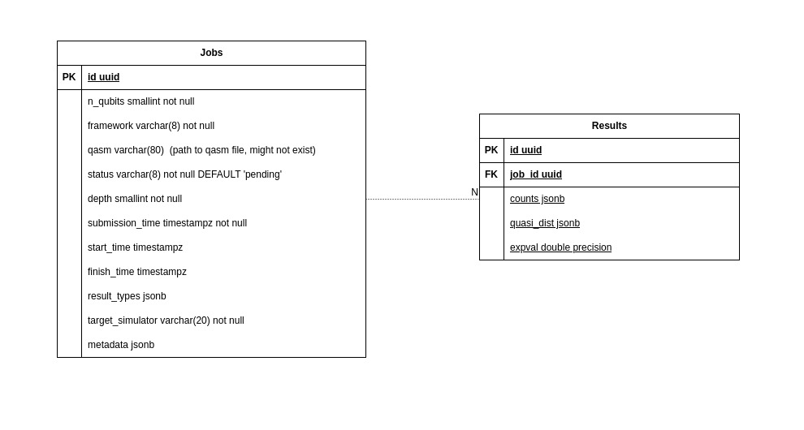

# QServer

An entire setup to run your quantum circuits in a separated machine.

# Why?

The main reason for this project was a problem I had during my first scientific research.

At that time, I had to run many different experiments, and most part of them were time-cost. Due to that, always when I needed to run some experiment, it was sure that I was unable to do anything else on my computer.

You may think, "why Didn't You upload your jobs to IBM QPUs or something similar". Well, there're some reasons:

1. errors

Even though my projects took to long to run, they had up to 30 qubits, so running these small experiments on QPUs with 100+ qubits were prone to errors caused by the idle ones. Probably, there were some techniques to reduce them, but I had no time to deep dive on that at that moment.

2. free QPUs

Even though IBM has many different quantum systems available, only a tiny portion of them are free available. I'm not saying this approach is unfair, once these machines are very expensive and complicated to maintain. However, as an undergrad student, I had not access to the systems I needed for my research.

3. long queues

When submitting a job to IBM's infrastructure, it's not always you get you job running right away, most part of the time you need to wait for days to get your results.

---

I'm not saying that using these cloud providers are bad, but there's always some trade-offs you'll face.

Also, for experiments aiming to test hardware and quantum algorithms in real scenarios, submitting to a real hardware is always the best idea.

# QServer is for who?

Saying the reasons I've built qserver, here's a list of who can be  beneficiated by using this:

- Curious people who wants to run circuits while learning
- People with limited hardware but have access to better machines 
- Homelab lovers
- Quantum computing enthusiasts 

# How does it work?

This project is developed as multiple services orchestrated via docker compose.

Its structure follows the diagram bellow:

After developing your circuit, all data related to it is send to the server via GRPC/Protobuf and a job is added to a rabbitmq queue waiting to be executed by a worker. When a job is finished, all data is saved on a postgres database and it can be retrieved using the http API.

Internally, there're are two main pieces: A GRPC server and a HTTP server. To make it easier to connect, a NGINX reverse proxy is put before those services, letting access different services using the same IP/host and also configuring TLS.

By default, the NGINX proxy listen on ports 8080(http/GRPC) and 443(https/GRPC+TLS) and a static IP is set, being: `172.18.0.30`.

---

To actually run a job, you must have had pre installed a quantum plugin. You can find the available ones [here](https://github.com/quantum-plugins/plugins-list).

If you want to some plugin that doesn't exist yet, you can create your own using [this template](https://github.com/quantum-plugins/quantum-server-plugin-template) and them opening an issue on [quantum-plugins/plugins-list](https://github.com/quantum-plugins/plugins-list). Your plugin will be added as a fork into our organization and listed on the main repo.

The admission for plugins works as the following:

It's not required to publish your plugin to PYPI, but you're free to do that.

---

Once a plugin is requested by a worker, it will be downloaded, if it exists, and the process will continue.

---

With the backend in hands, the circuit is ready to run.

You can request the server to extract multiple types of results. The options you have are: `expval`, `counts` and `quasi_dist`.
The job is run iteratively till all result types are gotten.

Doing that, the data is saved on a Postgres DB.

You can see the Structure below:

