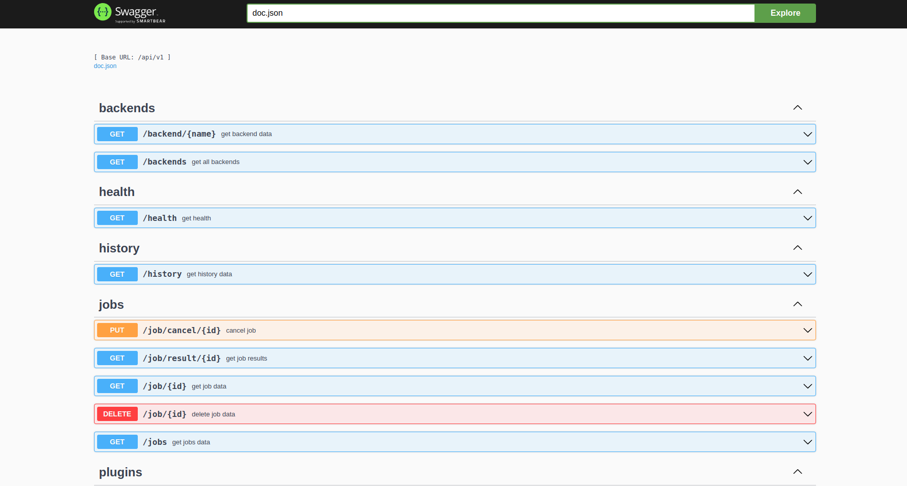

# QServer


An entire setup to run your quantum circuits in a separated machine.

## Why?

The main reason for this project was a problem I had during my first scientific research.

At that time, I had to run many different experiments, and most part of them were time-cost. Due to that, always when I needed to run some experiment, it was sure that I was unable to do anything else on my computer.

You may think, "why Didn't You upload your jobs to IBM QPUs or something similar". Well, there're some reasons:

1. errors

Even though my projects took to long to run, they had up to 30 qubits, so running these small experiments on QPUs with 100+ qubits were prone to errors caused by the idle ones. Probably, there were some techniques to reduce them, but I had no time to deep dive on that at that moment.

2. free QPUs

Even though IBM has many different quantum systems available, only a tiny portion of them are free available. I'm not saying this approach is unfair, once these machines are very expensive and complicated to maintain. However, as an undergrad student, I had not access to the systems I needed for my research.

3. long queues

When submitting a job to IBM's infrastructure, it's not always you get you job running right away, most part of the time you need to wait for days to get your results.

---


I'm not saying that using these cloud providers are bad, but there's always some trade-offs you'll face.

Also, for experiments aiming to test hardware and quantum algorithms in real scenarios, submitting to a real hardware is always the best idea.

## QServer is for who?

Saying the reasons I've built qserver, here's a list of who can be  beneficiated by using this:

- Curious people who wants to run circuits while learning
- People with limited hardware but have access to better machines 
- Homelab lovers
- Quantum computing enthusiasts 


## How does it work?

This project is developed as multiple services orchestrated via docker compose.

Its structure follows the diagram bellow:


After developing your circuit, all data related to it is send to the server via GRPC/Protobuf and a job is added to a rabbitmq queue waiting to be executed by a worker. When a job is finished, all data is saved on a postgres database and it can be retrieved using the http API.


Internally, there're are two main pieces: A GRPC server and a HTTP server. To make it easier to connect, a NGINX reverse proxy is put before those services, letting access different services using the same IP/host and also configuring TLS.

By default, the NGINX proxy listen on ports 8080(http/GRPC) and 443(https/GRPC+TLS) and a static IP is set, being: `172.18.0.30`.

---

To actually run a job, you must have had pre installed a quantum plugin. You can find the available ones [here](https://github.com/quantum-plugins/plugins-list).

If you want to some plugin that doesn't exist yet, you can create your own using [this template](https://github.com/quantum-plugins/quantum-server-plugin-template) and them opening an issue on [quantum-plugins/plugins-list](https://github.com/quantum-plugins/plugins-list). Your plugin will be added as a fork into our organization and listed on the main repo.

The admission for plugins works as the following:


It's not required to publish your plugin to PYPI, but you're free to do that.

---

Once a plugin is requested by a worker, it will be downloaded, if it exists, and the process will continue.


---

With the backend in hands, the circuit is ready to run.

You can request the server to extract multiple types of results. The options you have are: `expval`, `counts` and `quasi_dist`.
The job is run iteratively till all result types are gotten.

Doing that, the data is saved on a Postgres DB.

You can see the Structure below:


## How to use?

To run all that, you must install docker along with docker compose. Then get the compose file you want:

```bash
wget https://raw.githubusercontent.com/Dpbm/qserver/refs/heads/main/compose.yml

# or

wget  https://raw.githubusercontent.com/Dpbm/qserver/refs/heads/main/ghcr-prod-compose.yml
```

Then, you must set some env variables to configure the services access:

```bash
export DB_USERNAME="your user for db"
export DB_PASSWORD="you db user password"
export DB_ROOT_USER="root username"
export DB_ROOT_PASSWORD="root db user password"
export RABBITMQ_USER="rabbitmq username"
export RABBITMQ_PASSWORD="rabbitmq password"
```

Also, if you want to add https, you need to setup the `DOMAIN` variable:

```bash
export DOMAIN="your domain"
```

`Note: Remember to not use hard set env variables in production. Use your cloud provider secure alternative`

It's not mandatory, but we recommend you doing that. In case you're going to setup HTTPS, there's a script to setup your certs using `certbot`. Doing that is, sometimes, very trick, so I'm letting here the setup I did in my environment, but remember to check [let's encrypt documentation](https://letsencrypt.org/docs/) and [certbot's](https://certbot.eff.org/) as well.

In my case, I bought a real domain that can be reach outside on the internet and them used certbot to generate the certificates. 

```bash
# install certbot (check: https://certbot.eff.org/instructions?ws=nginx&os=pip)
sudo apt update && sudo apt install python3 python3-venv libaugeas0
sudo pip install certbot 

# get and run the script
cd /tmp
wget https://raw.githubusercontent.com/Dpbm/qserver/refs/heads/main/certs/generate-certs.sh
chmod +x ./generate-certs.sh && ./generate-certs.sh your-domain
```

Doing that, certbot will request you to add some information and then adding a acme challenge via DNS. Check your provider's documentation to see how to add that.
By the end of this process, certbot will generate the `.pem` files and will store that at `/etc/letsencrypt/archive/{your-domain}/`. This location is going to be mounted inside docker when running, so you don't need to do anything else.

Once we are running on a local network, it's not possible to access the domain right away. So to run:

```bash
sudo echo "172.18.0.30 your-domain" | sudo tee -a /etc/hosts
```

It's not required for cloud providers, by for local running it's a good option.

If you have this server running in the same network, but on a different machine, make the mapping using the other computer's IP.

Setting this up, we can run the docker compose file as:

```bash
# for dockerhub images
docker compose up -d 

# for ghcr images
docker compose -f ./ghcr-prod-compose.yml up -d
```

After some minutes, the server is ready to be used. You can check its API endpoints at: `http://your-domain:8080/swagger/index.html`, `https://your-domain/swagger/index.html` or even `http://172.18.0.30:8080/swagger/index.html` (remember this IP may change depending on where you're running it).



Beside these routes, the GRPC service run at the root path `/`. So, to add jobs this path must be used.

## Dev Usage

For devs, there's a bunch of different tools you may have installed to run each part isolated here are some of the main tools you need:

* make
* python >= 3.12
* go
* curl
* grpcurl
* mamba/conda-lock/conda
* pip/pip3
* bash/sh
* docker/docker compose
* openssl

If you're using Ubuntu based distros, there's a script to install some dependencies easily.

```bash
chmod +x install-system-dev-dependencies.sh
./install-system-dev-dependencies.sh
```

It doesn't install docker and python, go, conda and docker, so make sure to install it yourself.


### Janitor as Dev

Janitor is a small script to delete logs and qasm files after some predetermined time using cron jobs.

To run the tests first create a python environment:

```bash
cd ./janitor

# example with mamba
mamba env create -f environment.yml
mamba activate janitor

# conda-lock example
conda-lock install -n janitor conda-lock.yml
mamba activate janitor

# pip installation
pip install -r dev-requirements.txt
```

Then run: 
```bash
tox
```


### Proxy as DEV

To test the proxy instance, you first need to run the proxy itself. You can use the dev-compose file to set it up, but first, remember to set up your domain certs.

```bash
cd ./certs

export DOMAIN="your domain"
chmod +x generate-certs.sh
./generate-certs.sh "$DOMAIN"
```

then:

```bash
cd ..
# remember that the DOMAIN env variable must be set
docker compose -f ./dev-compose.yml up -d --build proxy
```

After some instants running, you'll be able to run the proxy tests with:

```bash
cd ./proxy
chmod +x test.sh
# remember that the DOMAIN env variable must be set
./test.sh
```

### GRPC server as DEV

First of all, install the go dependencies:

```bash
cd ./server/jobsServer
make install
```

Then, to test your GRPC server, first you need to make it run. You can do that using it locally on your machine, or inside docker.

The former can be done running:

```bash
docker compose -f ./dev-compose.yml up -d --build queue-handler db
cd ./server/jobsServer/
make run
```

and the latter:

```bash
docker compose -f ./dev-compose.yml up -d --build jobs-server
```

Finally, you can run the script to execute the tests

```bash
cd ./server/jobsServer/

# for local running instance
make test-local 

# for docker running instance
make test-docker
```

---

If you need to update the protobuf definition, also run:

```bash
make proto
```

to generate the new grpc go definition files.

---

Remember to lint the code as well:

```bash
make lint
```

### API as DEV

The rest api has the same logic as the GRPC server:


```bash
# install dependencies
cd ./server/restAPI
make install

--------------------------------------------------

# run locally
docker compose -f ./dev-compose.yml up -d --build db
cd ./server/restAPI/
make run

# run with docker
docker compose -f ./dev-compose.yml up -d --build api

--------------------------------------------------


# tests for local instance
make test-local

# test for docker instance
make test-docker

--------------------------------------------------

# linting
make lint
```

however, in the case you updated some routes, you'll likely want to update swagger definitions. For that, run:

```bash
make swagger
```


### Worker as DEV

The Worker, is a python script, so to run that the dependencies:


```bash
cd ./server/worker

# example with mamba
mamba env create -f environment.yml
mamba activate worker

# conda-lock example
conda-lock install -n janitor conda-lock.yml
mamba activate worker

# pip installation
pip install -r dev-requirements.txt
```

Start the worker instance:

```bash
# locally
docker compose -f ./dev-compose.yml up -d --build queue-handler db
cd ./server/worker
make run

# with docker
docker compose -f ./dev-compose.yml up -d --build workers
# notice that you can change the amount of workers running by changing the
# number of replicas in the compose file
```

---

To test your worker, you don't necessarily needs it running. You just need your python environment and then run:

```bash
cd ./server/worker
tox
```


### Other stuff

There're some other things you can check and may help me improve, like the database setup which can be found [here](./server/database/) and the shared library used for both http and grpc servers, being found [here](./server/shared/).


## Contribute

Feel free to open an Issue or even open a pull request to help this project evolve.